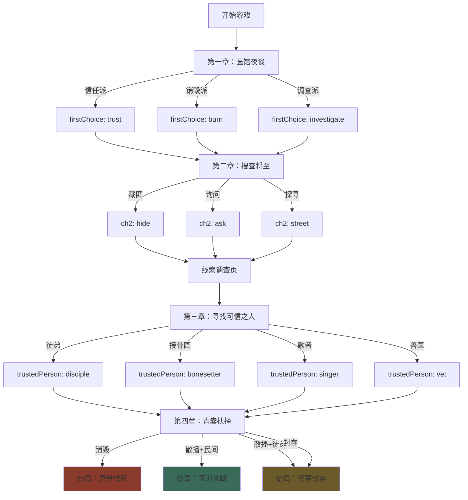

# 典故修补者 · 剧情结构文档

## 📋 剧情概览

**主题**：华佗之死 · 青囊经的抉择  
**核心冲突**：医术传承 vs 安全隐患  
**玩家身份**：华佗身边的小徒弟（附身）  
**时间限制**：一夜（五更）  
**游戏时长**：8-12分钟

---

## 🗺️ 章节流程图

```
封面页 (CoverPage)
    ↓
世界观页 (WorldPage) - 典故背景介绍
    ↓
章节选择 (ChapterSelectPage)
    ↓
┌─────────────────────────────────────────────────┐
│                  主线剧情流程                      │
└─────────────────────────────────────────────────┘

第一章：医馆夜谈 (ch1)
├─ 场景：clinic_night
├─ 核心问题：「这书该留吗？」
└─ 三个选择分支：
    ├─ [A] 医术无罪，该留给值得信任的人 → set: firstChoice="trust"
    ├─ [B] 若会害人，不如毁掉 → set: firstChoice="burn"  
    └─ [C] 不能现在决定，先弄清真相 → set: firstChoice="investigate"
          ↓
    【线索解锁】：青囊残页

          ↓
第二章：搜查将至 (ch2)
├─ 场景：raid_coming
├─ 张力：官兵即将到达
└─ 三个行动分支：
    ├─ [A] 藏起残卷 → set: ch2="hide"
    ├─ [B] 追问华佗徒弟，他记得多少 → set: ch2="ask"
    └─ [C] 去市井寻找传闻 → set: ch2="street"
          ↓
    【跳转】：线索页面 (CluePage)

          ↓
线索调查页 (CluePage)
├─ 5个线索可查看（无限制顺序）
├─ 每个线索提供不同视角
└─ 线索列表：
    ├─ 青囊残页 - 残存的医理文本
    ├─ 药方抄本 - 徒弟誊抄的实用方子
    ├─ 徒弟口述 - 活着的人也能是一本书
    ├─ 民谣片段 - 歌谣传播医理
    └─ 施针图 - 针法图解
          ↓
    【完成后返回】→ 第三章

          ↓
第三章：寻找可信之人 (ch3)
├─ 场景：find_trust
├─ 核心问题：「若有一夜，只能托付一人」
└─ 跳转到托付页面 (TrustRoutePage)
          ↓
托付选择页 (TrustRoutePage)
├─ 4个可选人物
└─ 人物选项：
    ├─ 大徒儿·吴普 (disciple) - 最懂华佗，但可能被牵连
    ├─ 隐村接骨匠·老栾 (bonesetter) - 手艺高超，记性极好
    ├─ 民间歌者·阿瑶 (singer) - 用歌谣传播医理
    └─ 兽医·老周 (vet) - 懂生命之理，可散于民间
          ↓
    set: trustedPerson = [选中的角色id]
          ↓
第四章：青囊抉择 (ch4)
├─ 场景：final_choice
├─ 核心问题：「做吧。我已经太老，做不了这件事了」
└─ 三个最终决定：
    ├─ [A] 毁去原卷，以绝后患 
    │     → set: finalDecision="burn" → 结局：ash
    ├─ [B] 藏于民间，散于有缘
    │     → set: finalDecision="scatter" → 结局：living/sealed
    └─ [C] 暂且封存，待后来人
          → set: finalDecision="seal" → 结局：sealed
          ↓
    【跳转】→ 结局页面 (EndingPage)

          ↓
结局页 (EndingPage)
├─ 根据 finalDecision + trustedPerson 计算结局
└─ 三种结局：
    ├─ 原卷成灰 (ash) - 遗憾未竟
    ├─ 密室封存 (sealed) - 遗憾半修
    └─ 医道未断 (living) - 医道未断 ✨
          ↓
    【解锁】→ 结局图鉴 (GalleryPage)
```

---

## 🎭 剧情分支树（决策流程）

```
                    开始游戏
                       ↓
            ┌──────────┴──────────┐
            │   第一章：初始认知    │
            └──────────┬──────────┘
                       ↓
         ┌─────────────┼─────────────┐
         │             │             │
      [信任派]      [销毁派]     [调查派]
   firstChoice:   firstChoice:  firstChoice:
     "trust"        "burn"     "investigate"
         │             │             │
         └─────────────┴─────────────┘
                       ↓
            ┌──────────┴──────────┐
            │  第二章：紧急应对     │
            └──────────┬──────────┘
                       ↓
         ┌─────────────┼─────────────┐
         │             │             │
      [藏匿]        [询问]        [探寻]
    ch2:"hide"    ch2:"ask"    ch2:"street"
         │             │             │
         └─────────────┴─────────────┘
                       ↓
            ┌──────────┴──────────┐
            │   线索调查阶段        │
            │  （5个线索自由查看）   │
            └──────────┬──────────┘
                       ↓
            ┌──────────┴──────────┐
            │  第三章：托付对象     │
            └──────────┬──────────┘
                       ↓
         ┌─────────────┼─────────────┬─────────────┐
         │             │             │             │
      [徒弟]       [接骨匠]       [歌者]        [兽医]
   trustedPerson: trustedPerson: trustedPerson: trustedPerson:
   "disciple"     "bonesetter"    "singer"       "vet"
         │             │             │             │
         └─────────────┴─────────────┴─────────────┘
                       ↓
            ┌──────────┴──────────┐
            │  第四章：最终决定     │
            └──────────┬──────────┘
                       ↓
         ┌─────────────┼─────────────┐
         │             │             │
      [销毁]        [散播]        [封存]
  finalDecision: finalDecision: finalDecision:
     "burn"        "scatter"       "seal"
         │             │             │
         ↓             ↓             ↓
    ┌────────┐   ┌────────┐   ┌────────┐
    │ 结局A  │   │ 结局B/C│   │ 结局C  │
    │原卷成灰│   │医道未断│   │密室封存│
    │  ash   │   │ living │   │ sealed │
    └────────┘   │/sealed │   └────────┘
                 └────────┘
```

---

## 🎯 结局判定逻辑

### 结局计算规则（`resolveEnding` 函数）

```javascript
function resolveEnding(state) {
  const { finalDecision, trustedPerson } = state;
  
  // 规则1: 选择销毁 → 原卷成灰
  if (finalDecision === "burn") return "ash";
  
  // 规则2: 选择封存 → 密室封存
  if (finalDecision === "seal") return "sealed";
  
  // 规则3: 选择散播 → 根据托付对象决定
  if (finalDecision === "scatter") {
    // 托付给民间人士（接骨匠/歌者/兽医）→ 医道未断 ✨
    if (["singer", "bonesetter", "vet"].includes(trustedPerson)) {
      return "living";
    }
    // 托付给徒弟 → 密室封存（徒弟会被盯上）
    if (trustedPerson === "disciple") {
      return "sealed";
    }
    // 默认 → 医道未断
    return "living";
  }
  
  // 兜底 → 密室封存
  return "sealed";
}
```

### 结局详情

| 结局ID | 结局名 | 评级 | 触发条件 | 核心意义 |
|--------|--------|------|----------|----------|
| `ash` | 原卷成灰 | 遗憾未竟 | finalDecision="burn" | 医道彻底失传 |
| `sealed` | 密室封存 | 遗憾半修 | finalDecision="seal" 或 scatter+disciple | 书藏起来了，但后世未能发现 |
| `living` | 医道未断 | 医道未断 ✨ | finalDecision="scatter" + 民间人士 | 书没了，但医道活在民间 |

---

## 👥 角色关系图

```
                    华佗
                  (神医·将死之人)
                       │
                       │ 师徒关系
           ┌───────────┼───────────┐
           │           │           │
       【玩家】     大徒儿吴普    其他门徒
    （小徒弟附身）  (disciple)     (背景)
           │           │
           │           │
           └───────────┴─── 可托付的传承路径
                       │
      ┌────────────────┼────────────────┬────────────────┐
      │                │                │                │
  接骨匠老栾        歌者阿瑶         兽医老周        大徒儿吴普
 (bonesetter)       (singer)          (vet)        (disciple)
      │                │                │                │
   [山中匠人]       [民间传播]       [跨界应用]       [正统传承]
   手艺传承         歌谣口诀         兽医转人医      易被官府监控
```

---

## 🗃️ 数据结构说明

### GameState（游戏状态）

```typescript
interface GameState {
  firstChoice: string | null;      // 第1章选择："trust"|"burn"|"investigate"
  ch2: string | null;               // 第2章选择："hide"|"ask"|"street"
  searchedClues: string[];          // 已查看的线索id数组
  trustedPerson: string | null;     // 托付对象："disciple"|"bonesetter"|"singer"|"vet"
  finalDecision: string | null;     // 最终决定："burn"|"scatter"|"seal"
  currentChapter: number;           // 当前进度：1-5
  unlockedEndings: EndingId[];      // 已解锁结局：["ash","sealed","living"]
  lastEnding: EndingId | null;      // 最近一次结局
}
```

### 存储位置

- **localStorage key**: `loremender:huatuo:v1`
- **自动保存**: 每次状态变化自动调用 `saveState()`

---

## 📊 线索系统

| 线索ID | 线索名 | 图标 | 核心信息 | 传承意义 |
|--------|--------|------|----------|----------|
| `fragment` | 青囊残页 | scroll | 残存的医理文本 | 书本传承的局限性 |
| `prescription` | 药方抄本 | ledger | 徒弟誊抄的实用方子 | 可散播的实用知识 |
| `speak` | 徒弟口述 | lips | 「活着的人，也能是一本书」 | 口口相传的可能 |
| `ballad` | 民谣片段 | music | 市井儿童传唱的医理 | 文化基因式传播 |
| `needle` | 施针图 | needle | 人形穴位草图 | 图像化知识传承 |

**设计意图**：通过5个线索，让玩家理解"医道传承不只是书本"的核心主题。

---

## 🎨 场景美术需求

| 场景ID | 场景名 | 氛围 | 核心元素 | 使用章节 |
|--------|--------|------|----------|----------|
| `clinic_night` | 医馆夜景 | 静谧、凝重 | 烛火、药柜、残卷、窗棂 | 第一章 |
| `raid_coming` | 搜查将至 | 紧张、压迫 | 巷口、铁靴、雨夜、门外人影 | 第二章 |
| `find_trust` | 寻找托付 | 决断、信任 | 雨中四个剪影、选择的分叉路 | 第三章 |
| `final_choice` | 最终抉择 | 悲壮、释然 | 五更天、残卷在手、华佗苍老 | 第四章 |

---

## 🎯 开发建议：可视化剧情管理平台

### 🚨 你的痛点分析

1. **剧情分支难追踪**：多个选择点 × 多个结局 = 组合爆炸
2. **数据散落**：`story.ts`, `endings.ts`, `characters.ts` 分离
3. **改动成本高**：修改一个分支要翻多个文件
4. **测试困难**：不知道某个选择组合会通往哪个结局

### 💡 解决方案：专用剧情编辑器

我建议你开发一个**轻量级剧情可视化平台**，推荐两种方案：

---

## 方案一：基于现有工具（快速实现）

### 工具推荐：Mermaid.js（嵌入文档）

**优点**：
- 文本驱动，易于版本控制
- GitHub/Markdown 原生支持
- 学习成本低

**实现**：创建 `STORY_FLOW.mmd` 文件



---

## 方案二：独立可视化平台（推荐）

### 技术选型

| 功能模块 | 推荐技术 | 理由 |
|---------|---------|------|
| **图形编辑器** | React Flow / Cytoscape.js | 拖拽式节点编辑 |
| **数据管理** | JSON Schema + Monaco Editor | 类型安全 + 代码编辑 |
| **预览系统** | iframe + 你的游戏实例 | 即时测试 |
| **导出功能** | 直接生成 `story.ts` | 无缝集成 |

### 核心功能设计

#### 1. 节点类型系统

```typescript
type NodeType = 
  | "chapter"      // 章节节点
  | "dialogue"     // 对话节点
  | "choice"       // 选择分支
  | "state_change" // 状态变更
  | "condition"    // 条件判断
  | "ending"       // 结局节点
  | "clue"         // 线索解锁
  | "character";   // 角色托付
```

#### 2. 可视化画布示例

```
┌─────────────────────────────────────────────────┐
│  剧情编辑器 - 华佗·青囊残卷                       │
├─────────────────────────────────────────────────┤
│ [工具栏]                                         │
│  ➕ 添加章节  ➕ 添加对话  ➕ 添加选择  📊 查看结局树│
├─────────────────────────────────────────────────┤
│                                                 │
│   [章节1]  →  [对话A]  →  [选择分支]            │
│   医馆夜谈      华佗         ├─ 选项1 → [状态]   │
│                             ├─ 选项2 → [状态]   │
│                             └─ 选项3 → [线索]   │
│                                                 │
│   [章节2]  →  [选择分支]  →  [线索页]           │
│   搜查将至      ├─ 藏匿                          │
│                ├─ 询问                          │
│                └─ 探寻                          │
│                                                 │
│   [章节3]  →  [角色选择]  →  [章节4]            │
│   托付对象      徒弟/匠人/                       │
│                歌者/兽医                         │
│                                                 │
│   [章节4]  →  [最终选择]  →  [结局]             │
│   青囊抉择      销毁/散播/    ash/living/        │
│                封存           sealed            │
│                                                 │
└─────────────────────────────────────────────────┘
```

#### 3. 节点属性面板

当点击一个选择节点时，右侧显示：

```
┌─────────────────────────┐
│ 选择节点属性              │
├─────────────────────────┤
│ 显示文本：               │
│ [医术无罪，该留给...]    │
│                         │
│ Toast提示：              │
│ [你触碰到了真正的遗憾]   │
│                         │
│ 状态变更：               │
│ ✅ firstChoice = "trust" │
│ ➕ 添加状态变更          │
│                         │
│ 跳转目标：               │
│ [下一个对话节点] ▼       │
│                         │
│ 解锁线索：               │
│ [ ] 青囊残页             │
│ [ ] 药方抄本             │
│                         │
│ [保存] [取消]            │
└─────────────────────────┘
```

#### 4. 结局追踪视图

```
┌─────────────────────────────────────────────┐
│ 结局追踪器                                   │
├─────────────────────────────────────────────┤
│ 🔥 原卷成灰 (ash)                            │
│ └─ 触发条件：finalDecision = "burn"         │
│ └─ 可达路径：1条                             │
│    └─ Ch1(任意) → Ch2(任意) → Ch3(任意)     │
│       → Ch4(销毁)                            │
│                                             │
│ 🌱 医道未断 (living)                         │
│ └─ 触发条件：finalDecision = "scatter"      │
│              + trustedPerson ∈ {singer,     │
│              bonesetter, vet}               │
│ └─ 可达路径：3条                             │
│    ├─ Ch1(信任) → ... → Ch3(歌者) → Ch4(散播)│
│    ├─ Ch1(调查) → ... → Ch3(匠人) → Ch4(散播)│
│    └─ Ch1(任意) → ... → Ch3(兽医) → Ch4(散播)│
│                                             │
│ 🧱 密室封存 (sealed)                         │
│ └─ 触发条件：finalDecision = "seal"         │
│              或 scatter + disciple          │
│ └─ 可达路径：4条                             │
└─────────────────────────────────────────────┘
```

---

## 🛠️ 实现路线图

### 阶段一：基础可视化（1-2天）

1. 创建 `STORY_STRUCTURE.md`（本文档） ✅
2. 用 Mermaid 绘制流程图嵌入 README
3. 创建 Excel/Notion 表格管理数据

### 阶段二：独立编辑器（1-2周）

1. 搭建 React Flow 画布
2. 实现节点类型和连线逻辑
3. 添加数据导入/导出（JSON ↔ TypeScript）
4. 集成预览功能

### 阶段三：高级功能（按需）

1. 多副本支持（李白、岳飞）
2. AI 辅助生成对话
3. 自动测试所有分支路径
4. 协作编辑（多人同时编辑剧情）

---

## 📈 数据驱动开发建议

### 当前问题

- 硬编码在 `story.ts` 中
- 修改需要重启开发服务器
- 无法热更新剧情

### 改进方案

#### 1. 配置文件化

```
src/
  data/
    dungeons/          # 副本目录
      huatuo/          # 华佗副本
        story.json     # 剧情数据
        characters.json
        clues.json
        endings.json
        config.json    # 副本配置
      libai/           # 李白副本
        ...
```

#### 2. 热更新支持

```typescript
// 在开发模式下，监听配置文件变化
if (import.meta.env.DEV) {
  import.meta.hot?.accept('./data/dungeons/huatuo/story.json', (newModule) => {
    updateStory(newModule.default);
  });
}
```

#### 3. CMS集成

使用 Strapi / Directus 等 Headless CMS：
- 策划直接在后台编辑剧情
- API 实时拉取数据
- 支持草稿/发布流程

---

## 🎯 最终建议

### 短期（现在立刻做）

1. **使用本文档**：把 `STORY_STRUCTURE.md` 放在项目根目录
2. **创建 Mermaid 图**：在 README 中嵌入流程图
3. **Excel 追踪表**：创建一个表格记录所有选择组合

### 中期（下个版本）

1. **搭建简易编辑器**：用 React Flow 实现可视化
2. **数据分离**：把剧情抽成 JSON 配置
3. **自动化测试**：写脚本遍历所有分支

### 长期（多副本阶段）

1. **专业剧情工具**：开发完整的 Narrative Designer Tool
2. **协作平台**：支持策划、程序、美术协同
3. **版本管理**：剧情版本控制和回滚

---

## 🔗 参考资源

- [Twine](https://twinery.org/) - 开源超文本故事编辑器
- [Yarn Spinner](https://yarnspinner.dev/) - 游戏对话系统
- [Ink](https://www.inklestudios.com/ink/) - 叙事脚本语言
- [Articy Draft](https://www.articy.com/) - 专业游戏叙事工具
- [React Flow](https://reactflow.dev/) - React 节点图库

---

## 📝 更新日志

- **2026-05-25**: 创建文档，梳理华佗副本完整流程
- 待补充：李白副本、岳飞副本...
